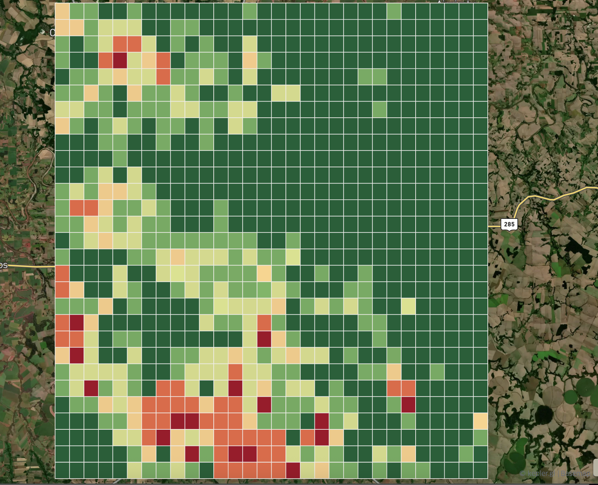
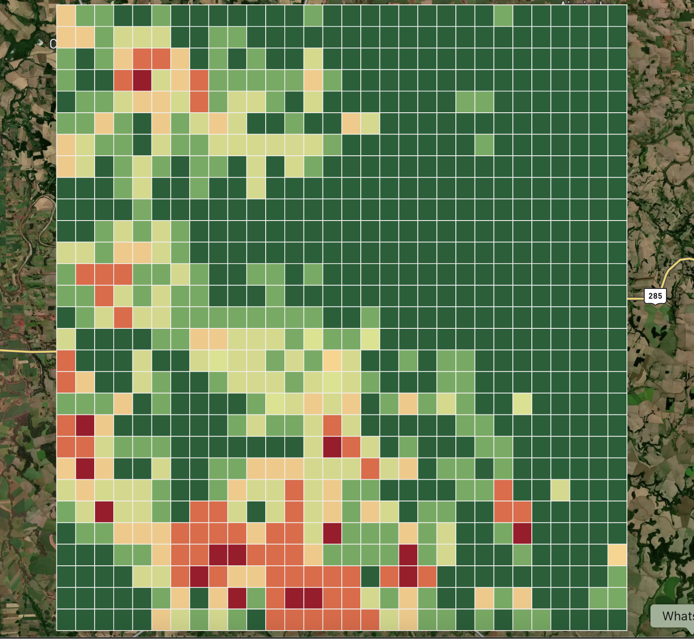
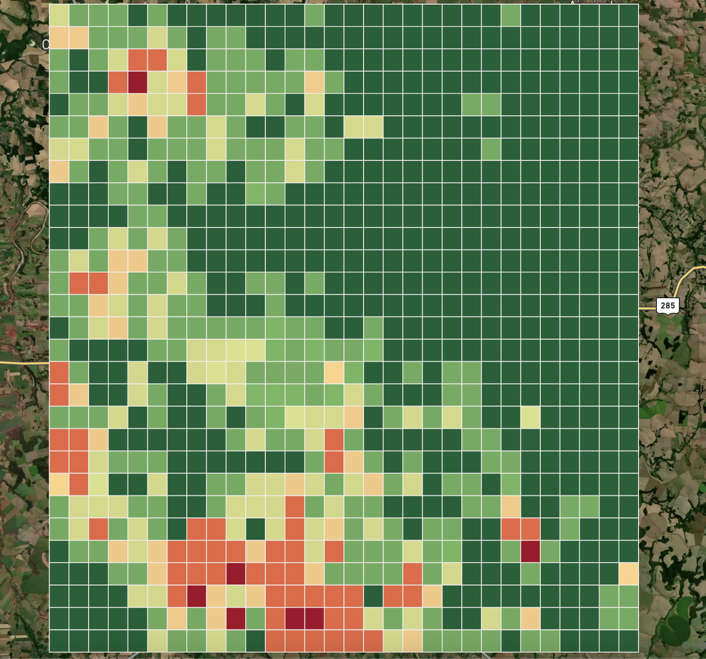
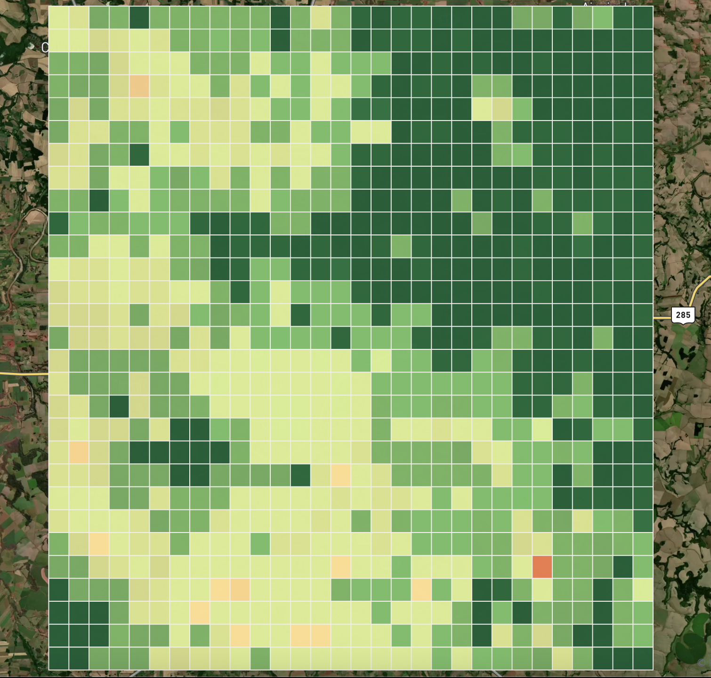
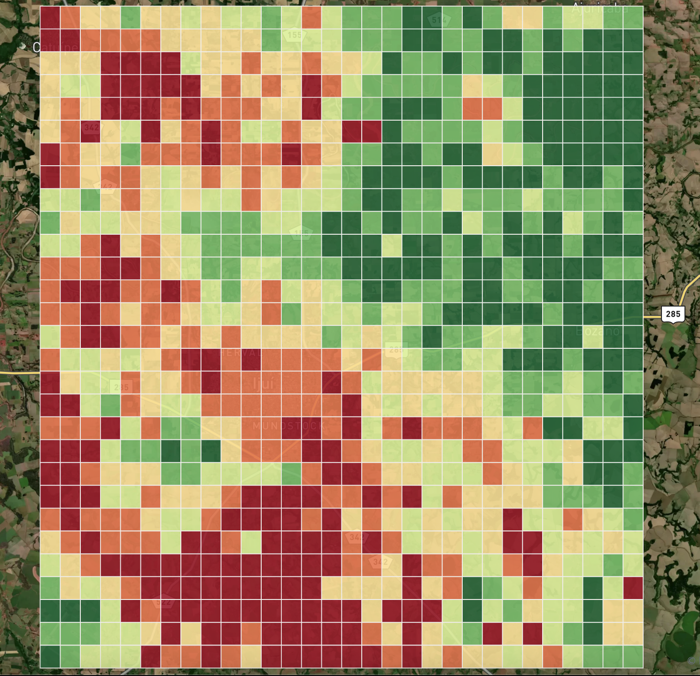

# NDVI Monitoring for Vegetation Change Detection

**Satellite-based NDVI monitoring to detect vegetation loss, using PySpark, Delta Lake, and Kepler.gl for geospatial analysis and visualization.**

---

## 📌 Overview

This project automates the extraction, transformation, and visualization of NDVI (Normalized Difference Vegetation Index) data over the municipality of Ijuí, Brazil, from 2014 to 2024. Built entirely within [Databricks](https://databricks.com/) using **PySpark** and **Delta Lake**, it allows spatial-temporal analysis of vegetation loss through GeoJSON exports and interactive timelapse maps rendered in **Kepler.gl**.

---

## 🛰️ Objective

* Detect changes in vegetation cover over time using NDVI metrics
* Highlight regions with potential deforestation or land-use conversion
* Enable geospatial visualization of these changes using polygon grids (1 km² cells)

---

## 🛠️ Tech Stack

* **Databricks Community Edition** (development platform)
* **PySpark** (data processing)
* **Delta Lake** (data versioning and layering: bronze, silver, gold)
* **Kepler.gl** (visual analytics and timelapse maps)
* **GeoJSON** (export format for map visualization)

---

## 📊 NDVI Interpretation

* `NDVI` values range from **-1 to 1**, with higher values indicating denser vegetation.
* This pipeline computes the **year-over-year percentage change** (`queda_pct`) for each 1km² cell.
* The GeoJSON includes fields:

  * `year`: time reference
  * `queda_pct`: NDVI variation (%)
  * `ndvi_real`: raw NDVI value

---

## 🧱 Visualization with Kepler.gl

1. Go to [https://kepler.gl](https://kepler.gl)
2. Upload the file: `ndvi_gold_ijui_grid_1km_2014_2024.geojson`
3. Add a **Polygon Layer**
4. Color by `queda_pct`, configure color gradient (e.g. blue → red)
5. Animate using the `year` field

---

## 📸 Yearly NDVI Variation Maps (2014 – 2022)

Below are example snapshots from Kepler.gl for each year:

| Year | NDVI Map                     |
| ---- | -----------------------------|
| 2014 | |
| 2015 | |
| 2016 | |
| 2021 | |
| 2022 | |

> These maps visualize year-over-year NDVI changes. Higher negative values indicate stronger vegetation loss.

---

## 🧪 Example Use Cases

* Environmental monitoring
* Urban expansion analysis
* Agricultural impact tracking
